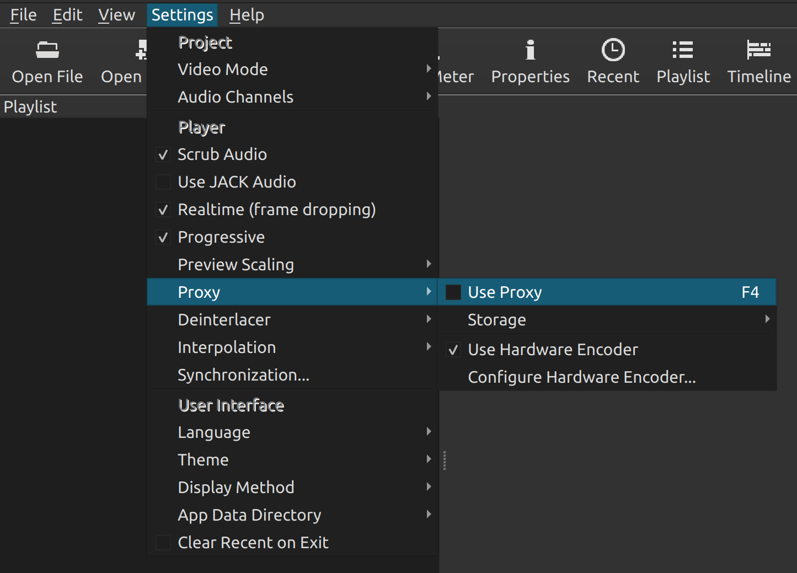
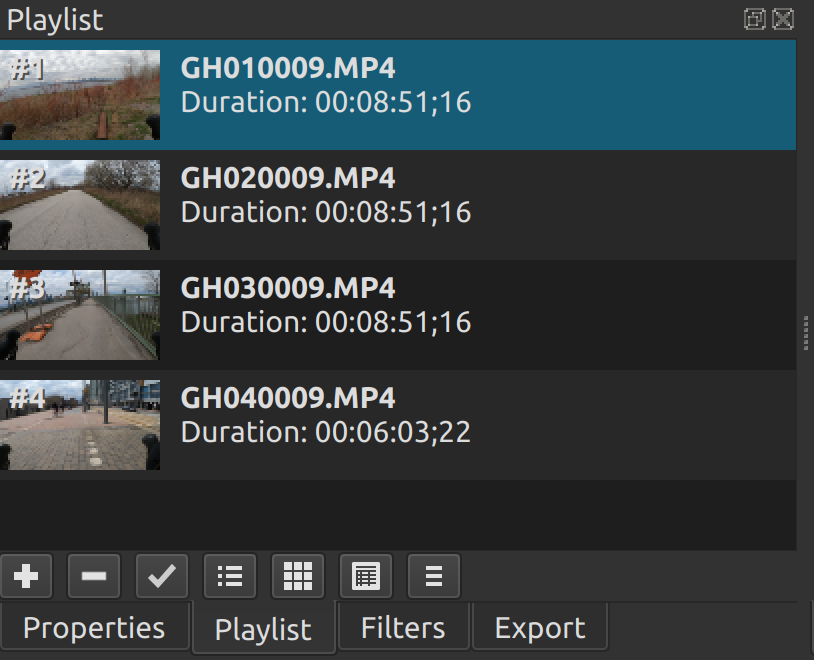
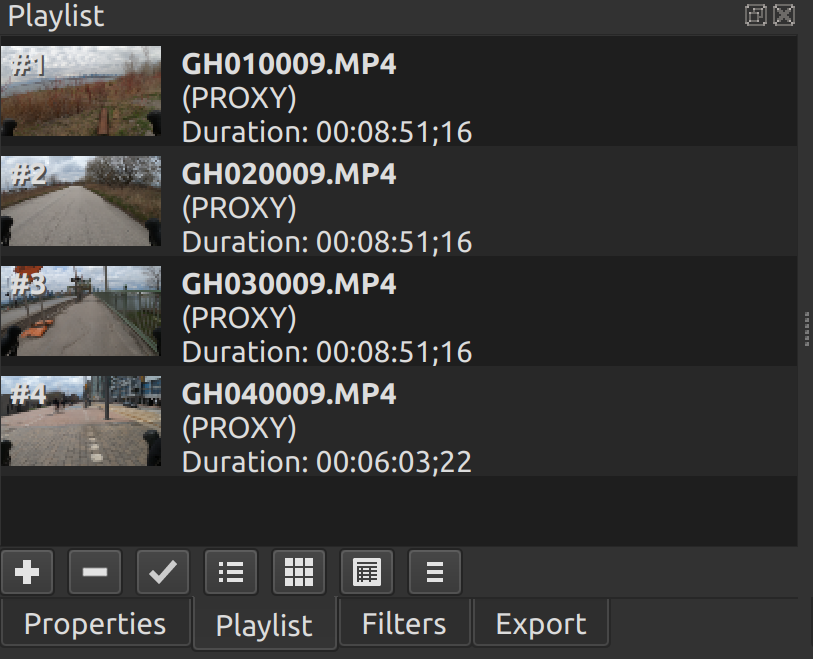

# Shotcut Load GoPro Proxies
[](https://www.python.org/) [](./LICENSE.txt)
## Table of contents
* [General Info](#general-info)
* [Requirements](#requirements)
* [Usage](#usage)

## General Info
[Shotcut](https://www.shotcut.org/) is an open-source video editing software. Since version 20.06, the software allows setting [proxy clips](https://forum.shotcut.org/t/proxy-editing/18517) for project videos. This feature enables working with low resolution videos when editing, saving computer power while editing. When the final video is rendered it is rendered based on the full resolution versions of the videos.

GoPro cameras automatically generate low resolution versions of the original videos captured. These videos are saved in the GoPro video directory as .LRV files (Low Resolution Video). They are intended to be used for viewing playback footage on the camera or the GoPro app.

This script takes the low resolution versions generated by the GoPro camera and uses them in your Shotcut project as proxy clips. This saves you the processing time and resources required to generate the proxy clips with Shotcut!

## Requirements
[Python 3](https://www.python.org/downloads/) is required to run the script.

## Usage
* Create a new Shotcut project
* Verify the "Proxy clips" setting is disabled

* Add your high resolution GoPro videos to the project

* Run the [ShotcutLoadGoProProxies.py](./ShotcutLoadGoProProxies.py) Python script, specifying the `--shotcut-path` parameter as the path to your Shotcut project directory (which includes the `.mlt` project file)
```
./ShotcutLoadGoProProxies.py --shotcut-path <SHOTCUT_PROJECT_DIRECTORY>
INFO:Retrieving original video files from Shotcut project...
INFO:Searching for low resolution versions of video files (.LRV)...
INFO:Copying low resolution files to Shotcut proxies directory...
INFO:Created proxies directory
INFO:Copied GL030009.LRV to ebcdd21db41c1e4d861f6e36f85694ff.mp4
INFO:Copied GL010009.LRV to c28642a33762c6300358634badefa722.mp4
INFO:Copied GL020009.LRV to f62ffb6d6b814286f41a8c27593cffaa.mp4
INFO:Copied GL040009.LRV to 8db4df04d4522f4003476592de8d1757.mp4
```
* Enable the "Proxy clips" setting in your Shotcut project
  * Note: A popup dialog will appear asking if you want to generate proxies for files missing a proxy clip. If you select "Yes", proxies will be rendered for any files for which no low resolution version was found and copied with the Python script.
* Observe that `(PROXY)` was added to the names of clips for which a low resolution GoPro version was found.
